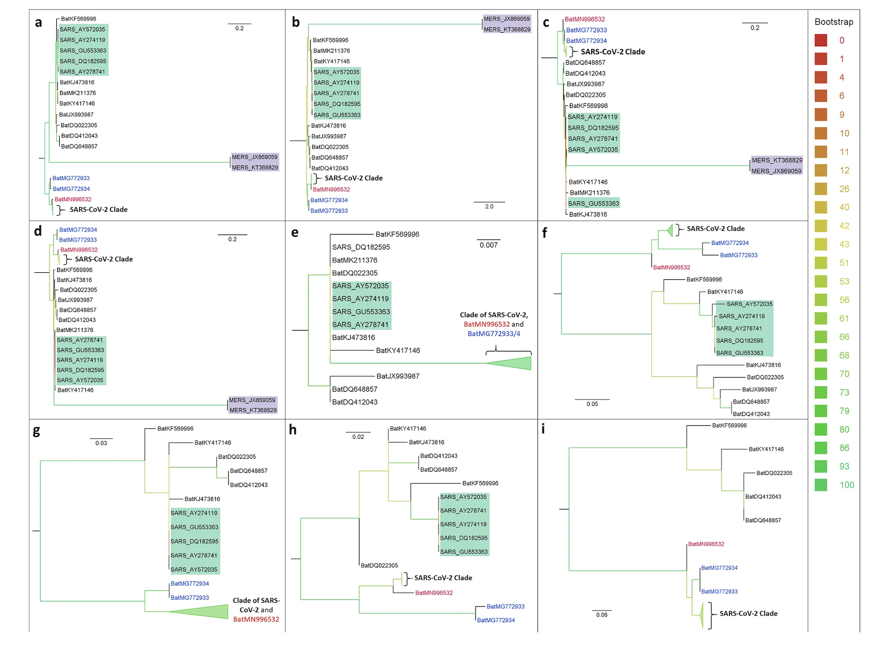

# Newick-Parser-for-COVID-19-Phylogenetic-Trees
## About The Project
Parser using Flex and Bison to recognize COVID-19 phylogenetic trees written in Newick format. It aims to determine the number of Spanish nodes, the count of those nodes that are leaves of the tree, and the height of these Spanish leaf node

This project was made for the Programming Technologies Subject of Universidad de Zaragoza.



Example of [Phylogenetic supertree reveals detailed evolution of SARS-CoV-2](https://www.nature.com/articles/s41598-020-79484-8)

### Installation

#### Flex

- **Linux:**
    Execute the following commands in the terminal:
     ```
     sudo apt-get update
     sudo apt-get install flex
     ```

- **macOS:**
    Use the following command in the terminal to install Flex with Homebrew:
     ```
     brew install flex
     ```

#### Bison

- **Linux:**
    Run the following command in the terminal to install Bison:
     ```
     sudo apt-get install bison
     ```

- **macOS:**
    Use the following command in the terminal to install Bison with Homebrew:
     ```
     brew install bison
     ```

### Usage 
1. Generate the lexer using Flex:
   ```bash
   flex necwick.l
   ```
2. Generate the parser using Bison:
    ```bash
   bison -d necwick.y
   ```
3. Compile the generated files:
   ```bash
   gcc lex.yy.c necwick.tab.c -o analyzer
   ```
4. Execute the analyzer, providing the input file:
   ```bash
   ./analyzer < nextstrain_ncov_europe_timetree.nwk
   ```


## Version History 

* 0.1
    * Initial Release

## Authors 

* **Raúl Daramus** - [RaulDaramus](https://github.com/RaulDaramus)

## License

This project is [LICENSED](LICENSE) check the file for details.

